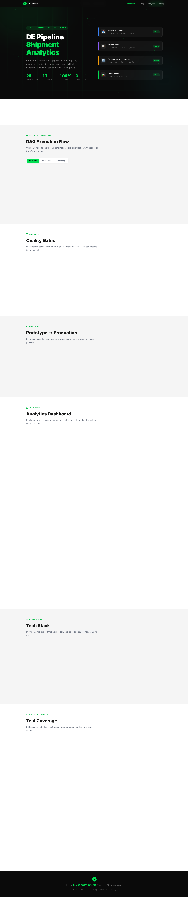

# DE Pipeline — Shipment Analytics

> **[View All Submissions — alizaabi.om/rihal-codestack](https://alizaabi.om/rihal-codestack/)**


**Showcase Page:** [alizaabi.om/rihal-codestack/pipeline.html](https://alizaabi.om/rihal-codestack/pipeline.html)

---


---



---

## Overview

Audited and hardened a broken Airflow ETL pipeline for shipment analytics. Identified and resolved **12 issues** — spanning security vulnerabilities, reliability gaps, and missing data quality controls. Added **28 tests** to lock in correctness going forward.

The pipeline extracts shipment data from a Flask API and customer tiers from a CSV file, transforms the data through a series of quality gates, and loads clean aggregated records into a PostgreSQL analytics table.

---

## Pipeline Flow

```
Extract (parallel)                Transform                     Load
──────────────────────────────    ──────────────────────────    ─────────────────────────────
Flask API → 21 shipment rows      Dedup          21 → 20        analytics.shipping_spend_by_tier
  3-retry exponential backoff  →  Null filter    20 → 19    →   TRUNCATE + INSERT
CSV File  → customer tier SCD     Invalid cost   19 → 18        Idempotent, safe to re-run
                                  Tier join      18 → 17 clean
```

---

## 6 Critical Fixes

| # | Issue | Fix |
|---|-------|-----|
| 1 | **SQL injection** — f-string queries with raw user input | Parameterized queries (`%s`) throughout |
| 2 | **No retry** — single API call, fails on transient errors | 3-retry exponential backoff |
| 3 | **Port conflict** — API and Airflow both on 8080 | API moved to port 8000 |
| 4 | **No idempotency** — re-runs appended duplicate rows | `TRUNCATE + INSERT` pattern |
| 5 | **Hardcoded credentials** — DB password in plain source | Environment variables via `.env` |
| 6 | **No tests** — zero test coverage | 28 tests across 3 test files |

Full audit in [ENGINEERING_AUDIT.md](ENGINEERING_AUDIT.md).

---

## Data Quality Gates

```
21  raw records from API
 → 20  after deduplication (SHP002 appeared twice)
 → 19  after null filter (missing customer_id)
 → 18  after invalid cost removal (cost <= 0)
 → 17  clean records loaded into analytics table
```

---

## Test Coverage — 28 Tests, 100% Pass Rate

| File | Tests | What's Covered |
|------|-------|----------------|
| `test_extract_shipments.py` | 10 | API fetch, retry logic, error handling, SQL injection prevention |
| `test_transform.py` | 12 | Dedup, null filter, cost validation, SCD tier join, edge cases |
| `test_load.py` | 6 | DB insert, idempotency, connection error handling |

---

## Tech Stack

| Tool | Version |
|------|---------|
| Apache Airflow | 2.7 |
| Python | 3.11 |
| PostgreSQL | 15 |
| Flask (Mock API) | Latest |
| Docker Compose | v2 |
| pytest | Latest |

---

## Quick Start

```bash
# Clone the repo
git clone https://github.com/zaabi1995/rihal-de-pipeline.git
cd rihal-de-pipeline

# Start all services (Airflow, PostgreSQL, Mock API)
docker-compose up -d

# Wait ~2-3 minutes for Airflow to initialize, then open:
# Airflow UI:  http://localhost:8080  (admin / admin)
# Mock API:    http://localhost:8000/api/shipments

# Trigger the pipeline
# 1. Find "shipment_analytics_pipeline" in the DAG list
# 2. Toggle it ON
# 3. Click the Play button to run manually

# Check results
docker-compose exec postgres psql -U airflow -d airflow -c \
  "SELECT * FROM analytics.shipping_spend_by_tier ORDER BY year_month, tier;"

# Run tests
docker-compose exec airflow-webserver pytest /opt/airflow/tests/ -v

# Stop
docker-compose down        # stop services
docker-compose down -v     # stop + delete all data
```

---

## Project Structure

```
.
├── dags/
│   └── shipment_analytics_dag.py    # Airflow DAG definition
├── scripts/
│   ├── extract_shipments.py         # API extract (retry, parameterized SQL)
│   ├── extract_customer_tiers.py    # CSV extract with validation
│   ├── transform_data.py            # Filter, dedup, SCD tier join
│   └── load_analytics.py            # Idempotent aggregation load
├── sql/
│   └── init.sql                     # Schema, constraints, indexes
├── data/
│   └── customer_tiers.csv           # Customer tier source (SCD2)
├── api/
│   ├── app.py                       # Mock shipment API (Flask)
│   └── Dockerfile
├── tests/
│   ├── conftest.py                  # Fixtures, mock DB, sample data
│   ├── test_extract_shipments.py
│   ├── test_transform.py
│   └── test_load.py
├── docker-compose.yml
├── Dockerfile
├── ENGINEERING_AUDIT.md             # Full issue audit
├── DESIGN_REFLECTION.md             # Design decisions and trade-offs
└── README.md
```

---

## Author

**Ali Al Zaabi**
Rihal CODESTACKER 2026 — Challenge #4: Data Engineering

---

## Other Challenges
- [Visit Oman](https://github.com/zaabi1995/rihal-visit-oman) — Challenge #1: Frontend Development
- [FlowCare API](https://github.com/zaabi1995/rihal-flowcare) — Challenge #2: Backend Development
- [Muscat 2040](https://github.com/zaabi1995/rihal-muscat-2040) — Challenge #6: Data Analytics
